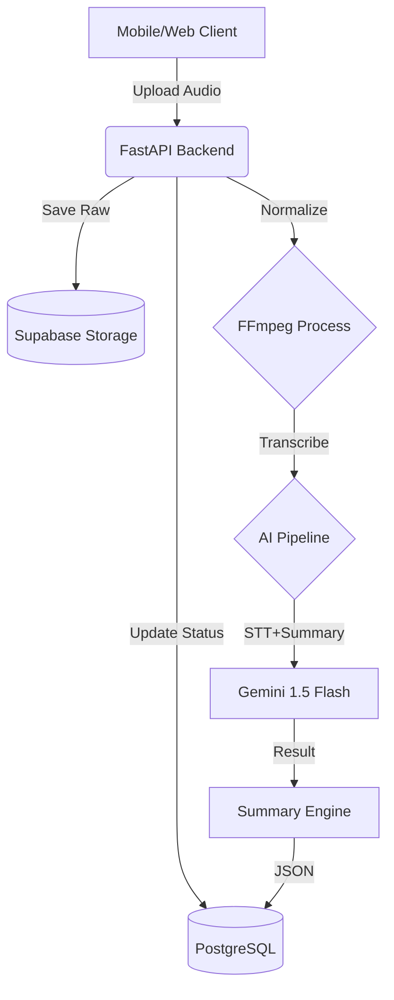
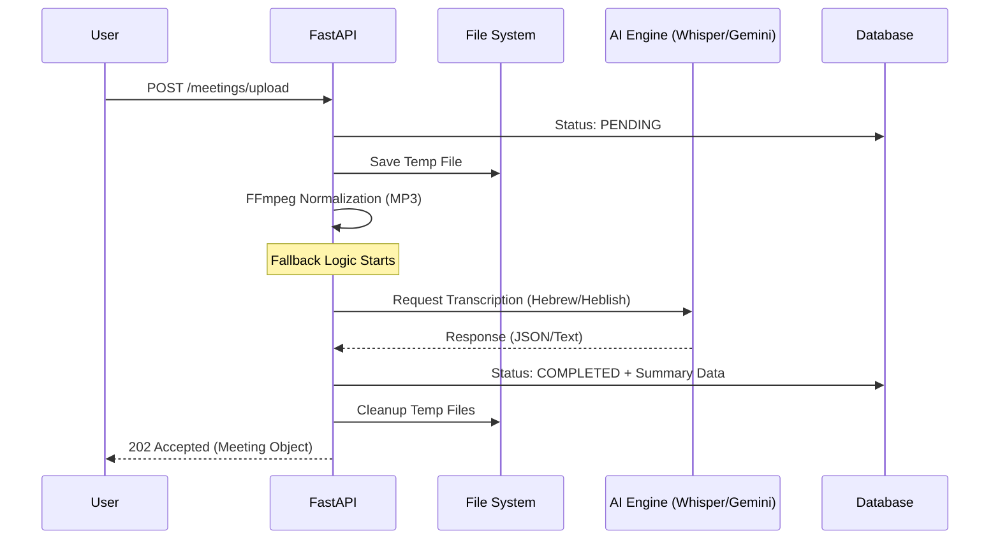

# SalesEcho AI - System Architecture

This document provides a comprehensive overview of the SalesEcho AI system architecture, including system flow, AI pipeline sequence, and maintenance best practices.

## System Architecture

The following diagram illustrates the high-level system architecture and data flow:



### Architecture Components

**Client Layer:**
- Mobile/Web applications upload audio files via REST API
- Supports multiple audio formats (MP3, M4A, WAV, WEBM, etc.)

**Backend Layer (FastAPI):**
- Receives multipart/form-data uploads
- Manages temporary file storage
- Coordinates AI pipeline execution
- Handles error recovery and logging

**Storage Layer:**
- **Supabase Storage**: Raw audio files (temporary, deleted after processing)
- **PostgreSQL**: Meeting records, transcripts, summaries, metadata

**Processing Layer:**
- **FFmpeg**: Audio normalization (MP3, Mono, 16kHz, 64kbps)
- **AI Pipeline**: Transcription and summary generation
  - Provider: Gemini 1.5 Flash (Gemini-only pipeline)

**Data Layer:**
- Structured JSON summaries stored in PostgreSQL
- Full audit trail in `processing_errors` JSON field
- Usage tracking in `organization.usage_minutes`

## AI Pipeline Sequence

The following sequence diagram details the step-by-step flow of audio processing:



### Sequence Flow Details

**1. Upload Request:**
- User sends `POST /api/v1/meetings/upload` with audio file and metadata
- FastAPI validates file type (must be audio/*)
- Meeting record created with `status: "PENDING"`

**2. File Storage:**
- Audio file saved to temporary directory (`/tmp/salesecho_uploads/`)
- Unique filename generated (UUID-based)
- File path stored in `meeting.audio_url`

**3. Audio Pre-processing:**
- FFmpeg normalizes audio to standardized format:
  - Format: MP3
  - Channels: Mono (1 channel)
  - Sample Rate: 16kHz
  - Bitrate: 64kbps
- Normalized file replaces original for API upload
- Original file cleaned up after processing

**4. Transcription (Gemini-Only):**
- **Provider**: Gemini 1.5 Flash
  - Language: Hebrew (he) with Heblish support
  - Native audio processing
  - Direct file upload to Gemini API (using `google-genai` SDK v1.x)
  - Prompt-based diarization (`[Speaker A]:`, `[Speaker B]:`, `Rep`, `Client`)

**5. Summary Generation:**
- GPT-4o generates structured "Tachles" summary
- System Prompt v2.0 enforces:
  - Fact-based extraction (no inference)
  - Confidence scores (0.0-1.0) with source quotes
  - Heblish optimization (ILS currency, Israeli dates)
  - Review flag (`requires_review: true` if confidence < 0.7)

**6. Database Update:**
- Meeting status updated to `"COMPLETED"`
- Transcript stored in `meeting.transcript`
- Summary stored in `meeting.summary` (JSON)
- Usage tracked: `organization.usage_minutes` incremented

**7. Response & Cleanup:**
- HTTP 202 Accepted returned with meeting object
- Temporary files cleaned up (normalized + original)
- Error logs stored in `meeting.processing_errors` if any failures

## Maintenance & Best Practices

### Multi-tenancy

**Data Isolation:**
- All database queries filter by `org_id` for strict data isolation
- Row Level Security (RLS) policies enforce multi-tenancy at database level
- Application-level validation ensures `org_id` is present in all operations

**Implementation:**
- Every table includes `org_id` field (UUID)
- Foreign key constraints ensure referential integrity
- RLS policies use `org_id = (SELECT org_id FROM users WHERE auth.uid() = users.id)`

**Best Practices:**
- Never query without `org_id` filter
- Validate `org_id` ownership before operations
- Use Prisma `where` clauses with `org_id` in all queries

### Provider Strategy

**Gemini-Only Pipeline:**
- Transcription and Tachles summary both use Gemini 1.5 Flash.
- Errors (rate limits, model errors) are logged to `meeting.processing_errors` and set status to `"FAILED"` if unrecoverable.

**Monitoring:**
- Log fallback triggers for cost analysis
- Track provider usage in metrics
- Alert on repeated fallback failures

### Observability

**Error Tracking:**
- **Sentry Integration**: Structured error tracking with context
- **Database Logging**: All errors stored in `meeting.processing_errors` JSON field
- **Structured Logs**: JSON format for pipeline monitoring

**Log Levels:**
- `INFO`: Normal operations (transcription start, completion)
- `WARNING`: Non-critical issues (normalization fallback, API warnings)
- `ERROR`: Processing failures (transcription errors, API failures)
- `CRITICAL`: System-level failures (FFmpeg missing, database connection)

**Metrics to Track:**
- Transcription success rate (by provider)
- Average processing time
- File size reduction (pre/post normalization)
- Fallback trigger frequency
- Usage minutes per organization

**Structured Logging Format:**
```json
{
  "timestamp": "2026-02-14T10:00:00Z",
  "level": "INFO",
  "service": "transcription",
  "meeting_id": "uuid",
  "org_id": "uuid",
  "provider": "openai",
  "duration_seconds": 1800.5,
  "file_size_mb": 12.5,
  "normalized_size_mb": 6.2
}
```

### Performance Optimization

**Audio Pre-processing:**
- Normalization reduces file size by 50-70%
- Faster API uploads with smaller files
- Consistent format improves STT accuracy
- Ensures files stay under 25MB API limit

**Async Processing:**
- All I/O operations use `async/await`
- Non-blocking API calls to OpenAI/Gemini
- Database operations are async
- FastAPI async support fully leveraged

**Resource Management:**
- Temporary files cleaned up immediately after processing
- Normalized files removed after transcription
- Database connections pooled via Prisma
- Memory-efficient file handling

### Security Considerations

**File Upload Security:**
- File type validation (audio/* only)
- File size limits (50MB max)
- Temporary file storage with unique names
- Automatic cleanup on error

**Data Protection:**
- Multi-tenancy enforced at database level (RLS)
- `org_id` validation on all operations
- Sensitive data (CRM tokens) locked to service role
- Audit trail for all CRM operations

**API Security:**
- Rate limiting per user (future implementation)
- API key validation for AI providers
- Error messages don't expose internal details
- Structured error logging for security monitoring

## Technology Stack

**Backend:**
- FastAPI (Python 3.9+)
- Prisma ORM (PostgreSQL)
- Async/await architecture

**AI Services:**
- OpenAI Whisper v3 (STT)
- OpenAI GPT-4o (LLM)
- Google Gemini 1.5 Flash (Fallback)

**Infrastructure:**
- Supabase (PostgreSQL + Storage)
- FFmpeg (Audio processing)
- Sentry (Error tracking)

**Data Formats:**
- JSON (Summaries, errors, metadata)
- UTF-8 (Hebrew/English text)
- MP3 (Normalized audio)

## Future Enhancements

**Planned Improvements:**
- Real-time transcription streaming
- Batch processing for multiple files
- Advanced speaker diarization (AssemblyAI/pyannote)
- Caching for common transcript patterns
- Webhook notifications for completion
- Retry logic with exponential backoff

**Scalability:**
- Horizontal scaling with load balancer
- Queue system for async processing (Redis/RabbitMQ)
- CDN for audio file delivery
- Database read replicas for analytics

---

**Last Updated**: February 14, 2025  
**Version**: 1.0.0  
**Maintained By**: Technical Team
